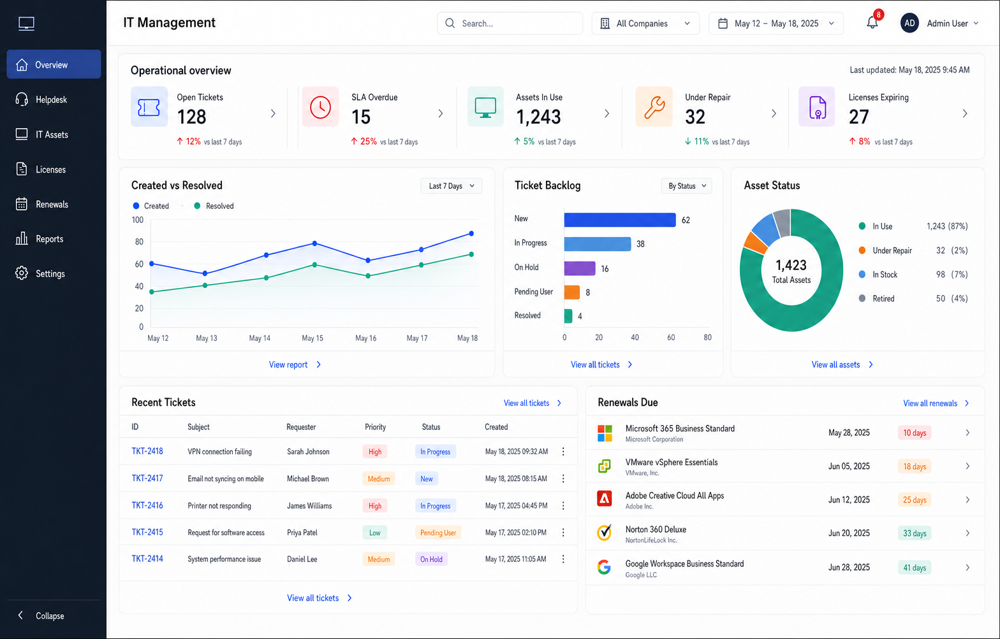

# แผนปรับปรุง UI: IT Management Dashboard

## 1. เป้าหมาย

ปรับ `IT Management Dashboard` ให้มีภาพลักษณ์และลำดับข้อมูลใกล้เคียง Mockup ที่ผู้ใช้เลือก โดยยังคงพฤติกรรมและความปลอดภัยของ Odoo 17:

- อ่านสถานะ Helpdesk, IT Asset และ License/Renewal ได้จากหน้าเดียว
- ใช้งานได้จริง ไม่เป็นเพียงภาพตกแต่ง
- KPI, กราฟ และรายการทุกส่วนกด Drill-down ไปยัง Source Records ได้
- Filter Company และช่วงเวลามีผลสอดคล้องกันทั้งหน้า
- ไม่แสดง `license_key`, password หรือข้อมูลลับ
- ไม่ทำลาย Helpdesk Dashboard และ IT Asset workflow เดิม
- ใช้โมเดล `buz.it.asset` เดิม ไม่แยกโมเดล Asset เพิ่ม

## Mockup อ้างอิงที่ผู้ใช้ตรวจเลือก



ให้ใช้ Mockup นี้เป็น Visual Reference หลักสำหรับโครงสร้าง, ลำดับข้อมูล,
สี, typography, spacing และ interaction ของหน้า Overview โดยมีองค์ประกอบสำคัญ:

- Sidebar: Overview, Helpdesk, IT Assets, Licenses, Renewals, Reports และ Settings
- Operational overview พร้อม KPI 5 ตัว
- Created vs Resolved, Ticket Backlog และ Asset Status
- Recent Tickets และ Renewals Due
- Company/Date filters, Last updated และ Drill-down affordance
- Responsive layout ที่ยังคงลำดับความสำคัญของข้อมูล

ตัวเลข, วันที่, ชื่อบุคคล, ชื่อผลิตภัณฑ์และสถานะใน Mockup เป็นข้อมูลประกอบภาพเท่านั้น
ห้ามนำไป hardcode ในระบบ ข้อมูลจริงทั้งหมดต้องมาจาก Source Records
และผ่าน Company/Date filters, ACLs และ Record Rules
## 2. หลักการแปลง Mockup ให้เหมาะกับ Odoo

- ใช้ Odoo Web Client shell เดิมสำหรับ User Menu, Notifications และ Global Search เพื่อลด UI ซ้ำซ้อน
- สร้างเฉพาะ Dashboard header, filters, sidebar และ content ภายใน Client Action
- เมนู Licenses, Renewals, Reports และ Settings ต้องเปิด Odoo Action ที่มีอยู่และตรวจสิทธิ์ตาม Group
- กราฟใช้ OWL + SVG/CSS ที่ควบคุมได้ในโมดูลก่อนพิจารณา Dependency ภายนอก
- ตัวเลขเปรียบเทียบ เช่น `+12% vs last 7 days` ต้องมาจากช่วงเปรียบเทียบจริง ห้ามใช้ค่าคงที่
- สีต้องมีทั้งข้อความหรือ icon กำกับ ห้ามใช้สีอย่างเดียวเพื่อสื่อสถานะ

## 3. Gap Analysis

| ส่วน | สถานะปัจจุบัน | เป้าหมาย |
|---|---|---|
| Sidebar | Overview, Helpdesk, IT Asset | เพิ่ม icon, collapse และทางลัด Licenses, Renewals, Reports, Settings ตามสิทธิ์ |
| Header | ชื่อหน้าและ Company/Date filters | Operational overview, filter แบบกระชับ, Last updated และ Refresh |
| KPI | การ์ดตัวเลข 5 ใบ | Summary strip พร้อม icon, trend comparison และ Drill-down |
| Ticket trend | มีข้อมูล Created trend แบบแถว | Created vs Resolved line chart จากข้อมูลจริง |
| Ticket backlog | แสดงสถานะเป็นรายการ | Horizontal bar chart พร้อม count และ Drill-down |
| Asset status | แสดงสถานะเป็นรายการ | Donut chart พร้อม total, count, percentage และ Drill-down |
| Recent tickets | ยังไม่มีใน Unified Overview | ตาราง Ticket ล่าสุดตาม filter และ company |
| Renewals due | ยังไม่มีใน Unified Overview | รายการ License/Renewal ใกล้ครบกำหนด พร้อม severity |
| State handling | มี Loading/Error/Empty | เพิ่ม skeleton, retry, stale response protection และ per-panel empty state |
| Tests | ครอบคลุม KPI/domain/security พื้นฐาน | เพิ่ม trend, comparison, list payload, navigation, responsive และ accessibility checks |

## 4. Design System เป้าหมาย

### สี

- Canvas: `#F7F8FA`
- Surface: `#FFFFFF`
- Sidebar: `#0F1B2D`
- Primary text: `#172033`
- Secondary text: `#667085`
- Border: `#E4E7EC`
- Primary accent: `#3157D5`
- Success: `#12A57A`
- Warning: `#F79009`
- Critical: `#D92D20`
- Secondary accent: `#7A5AF8`

### Layout

- Sidebar desktop: 168–224 px และ collapse ได้
- Content: 12-column grid
- KPI summary: 5 columns บนจอใหญ่, 2 columns บน tablet, 1 column บน mobile
- Main charts: Trend 6 columns, Backlog 3 columns, Asset status 3 columns
- Bottom: Recent Tickets 7 columns, Renewals Due 5 columns
- Breakpoints เป้าหมาย: 1200, 900 และ 560 px

### Typography และ interaction

- ตัวเลข KPI ใช้ tabular figures
- หัวข้อ panel ชัดกว่าข้อความประกอบหนึ่งระดับ
- Clickable card/row ต้องรองรับ keyboard และมี focus state
- Hover ใช้ border/accent เบา ๆ ไม่ใช้ shadow หนัก
- Animation จำกัดเฉพาะ loading และ chart transition แบบสั้น พร้อมรองรับ `prefers-reduced-motion`

---

## ระยะที่ UI-0: Baseline และ Interaction Contract

### เป้าหมาย

ยืนยันข้อมูลและพฤติกรรมเดิมก่อนปรับ UI

### งาน

- เก็บ screenshot ของ Overview, Helpdesk และ IT Asset ปัจจุบัน
- บันทึก payload จาก `get_dashboard_data()` สำหรับแต่ละ section
- ระบุ Source Model และ Domain ของ KPI ทุกตัว
- ระบุ Odoo Action/XML ID สำหรับ Licenses, Renewals, Reports และ Settings
- กำหนดความหมายช่วงวันที่:
  - KPI ใช้ record date ใด
  - License Expiring ใช้ expiry date
  - Trend comparison ใช้ current period เทียบ previous period ที่ยาวเท่ากัน
- กำหนดสิทธิ์ Sidebar ของ Requester, Agent, Manager และ IT Asset Manager
- สร้าง Test fixture ปริมาณเล็กสำหรับ Ticket, Asset และ Renewal

### เกณฑ์ผ่าน

- มี baseline ที่ตรวจนับเทียบ Source Records ได้
- Domain และสิทธิ์ของทุก widget ได้รับการระบุ
- ยังไม่มีการเปลี่ยน UI หรือ business workflow

---

## ระยะที่ UI-1: Visual Foundation และ Dashboard Shell

### เป้าหมาย

สร้างโครง UI, design tokens และ responsive grid ตาม Mockup โดยยังใช้ข้อมูลเดิม

### งาน

- ปรับ Sidebar ให้มี icon, active state และ collapse
- ปรับ Header เป็น `IT Management` และ `Operational overview`
- จัด Company/Date filters เป็น compact controls
- เพิ่ม Refresh และ Last updated จากเวลาที่โหลดสำเร็จ
- สร้าง reusable OWL components:
  - `DashboardSidebar`
  - `DashboardFilterBar`
  - `DashboardPanel`
  - `DashboardState`
- เพิ่ม CSS variables สำหรับสี, spacing, radius และ typography
- เพิ่ม skeleton loading, panel empty state และ error retry
- ป้องกัน response เก่าทับ response ใหม่เมื่อเปลี่ยน filter เร็ว

### เกณฑ์ผ่าน

- Desktop ใกล้เคียงโครง Mockup โดยไม่จำลอง Odoo User Menu ซ้ำ
- Tablet/mobile ไม่เกิด horizontal overflow ที่ไม่จำเป็น
- Loading, Error และ Empty state แสดงได้ครบ
- การสลับ section ยังโหลดเฉพาะ section ที่เลือก

---

## ระยะที่ UI-2: KPI Summary และ Comparison

### เป้าหมาย

ยกระดับ KPI 5 ตัวให้เป็น Operational Summary ที่มีข้อมูลเปรียบเทียบจริง

### งาน

- KPI:
  - Open Tickets
  - SLA Overdue
  - Assets In Use
  - Under Repair
  - Licenses Expiring
- เพิ่ม payload:
  - `count`
  - `previous_count`
  - `delta`
  - `delta_percent`
  - `direction`
  - `domain`
- กำหนด semantic ของสีแยกตาม KPI เช่น Open Ticket เพิ่มอาจเป็น warning แต่ Asset In Use เพิ่มไม่จำเป็นต้องเป็น critical
- เพิ่ม icon และ Drill-down affordance
- แสดง `N/A` เมื่อ previous period ไม่มี denominator แทนการหารศูนย์

### Tests

- Count ตรง Source Records
- Previous period ไม่ซ้อน current period
- Delta และ percentage คำนวณถูกต้อง
- Drill-down domain เท่ากับ domain ที่ใช้คำนวณ
- Company/date filter ไม่ข้ามบริษัท
- Payload ไม่มีข้อมูลลับ

### เกณฑ์ผ่าน

- KPI ทุกตัวตรงกับ Source Records
- Comparison ไม่ใช้ค่าคงที่
- Click KPI เปิด list ที่จำนวนตรงกับ KPI

---

## ระยะที่ UI-3: Operational Charts

### เป้าหมาย

สร้างกราฟ Created vs Resolved, Ticket Backlog และ Asset Status จากข้อมูลจริง

### งาน

#### Created vs Resolved

- Backend คืน time series ที่มี date, created_count และ resolved_count
- วันที่ไม่มีข้อมูลต้องคืนค่า 0 เพื่อให้เส้นกราฟต่อเนื่อง
- ใช้วันที่ `create_date` สำหรับ Created และ `resolved_at` สำหรับ Resolved
- รองรับ 7, 30, 90 วัน หรือ custom date range ตามขอบเขตที่อนุมัติ

#### Ticket Backlog

- แสดงสถานะที่ยังเปิด พร้อม count และ domain
- เรียงตาม workflow หรือ count ตามตัวเลือก
- Click bar เปิด Ticket list

#### Asset Status

- แสดง total, count และ percentage
- สีสถานะคงที่ทั้ง Dashboard
- Click segment/legend เปิด Asset list
- รองรับกรณี total เป็น 0

### Tests

- Created/Resolved series ถูกต้องและเติมวันว่าง
- Backlog ไม่นับ Closed/Cancelled โดยไม่ตั้งใจ
- Asset percentage รวมประมาณ 100% ตามหลัก rounding
- ทุก chart domain เคารพ Company/date filters
- Empty chart ไม่เกิด JavaScript error

### เกณฑ์ผ่าน

- กราฟตรงกับ Source Records
- Legend, tooltip และ keyboard focus อ่านได้
- ไม่เพิ่ม chart dependency ภายนอกโดยไม่มีเหตุผลที่ตรวจสอบได้

---

## ระยะที่ UI-4: Recent Tickets และ Renewals Due

### เป้าหมาย

เพิ่มข้อมูลที่ผู้ดูแลสามารถลงมือทำต่อได้ทันทีจาก Overview

### งาน

#### Recent Tickets

- แสดง Ticket ล่าสุดแบบจำกัดจำนวน
- Fields: Ticket No., Subject, Requester, Priority, Status, Created
- ใช้ badge semantic ที่สอดคล้องกัน
- Click row เปิด record; `View all tickets` เปิด list ด้วย filter ปัจจุบัน
- ไม่ส่ง description, attachment หรือ chatter มาใน payload

#### Renewals Due

- แสดง Software License/Renewal ที่ใกล้ครบกำหนด
- Fields ที่ปลอดภัย: Product/Asset, Vendor, Expiry, Days remaining, Status
- Severity:
  - Critical: หมดอายุแล้วหรือเหลือไม่เกิน 7 วัน
  - Warning: 8–30 วัน
  - Attention: 31–60 วัน
- Click row เปิด Asset หรือ Renewal ต้นทาง
- `View all renewals` เปิด action ที่มีอยู่
- ห้ามส่ง `license_key`, password, mail body หรือ notification error detail

### Tests

- เรียง Recent Tickets และ Renewals ถูกต้อง
- จำกัดจำนวน record ตามที่กำหนด
- Days remaining และ severity ถูกต้องตาม company date/timezone
- Requester ไม่เข้าถึง payload
- Multi-company และ record rules ทำงาน
- Payload ไม่มี secret

### เกณฑ์ผ่าน

- ตารางและรายการตรง Source Records
- Drill-down เปิด record/action ถูกต้อง
- ไม่มีข้อมูลลับใน RPC payload หรือ DOM

---

## ระยะที่ UI-5: Sidebar Navigation และ Section Integration

### เป้าหมาย

ทำ Sidebar ให้เป็นศูนย์นำทางโดยไม่สร้างหน้าซ้ำกับ Odoo

### งาน

- Overview: แสดง Unified Overview
- Helpdesk: ใช้ Helpdesk Dashboard เดิมเป็น subcomponent
- IT Assets: ใช้ Asset Dashboard เดิม
- Licenses: เปิด action ของ `buz.it.asset` ที่ filter `software_license`
- Renewals: เปิด action ของ `buz.it.asset.renewal`
- Reports: เปิด Helpdesk/Asset report action ที่มีอยู่
- Settings: แสดงเฉพาะ Manager และเปิด configuration action ที่มีอยู่
- แสดงเมนูตามสิทธิ์จาก server-provided navigation config
- เก็บ collapsed state ใน browser storage โดยไม่เก็บข้อมูลธุรกิจ

### Tests

- Agent/Manager เห็นเมนูตามสิทธิ์
- Requester ไม่เห็นและเรียก endpoint ไม่ได้
- Manager-only user ใช้เมนูที่ควรเข้าถึงได้
- Action target และ domain ถูกต้อง
- Sidebar collapse ไม่ทำให้ keyboard navigation เสีย

### เกณฑ์ผ่าน

- ไม่มี dead menu หรือ action ที่เปิดแล้ว AccessError โดยไม่คาดหมาย
- การซ่อนเมนูไม่ใช่กลไก security เพียงอย่างเดียว
- Helpdesk/Asset behavior เดิมไม่ถูกรื้อเขียนใหม่

---

## ระยะที่ UI-6: Accessibility, Performance และ Responsive QA

### เป้าหมาย

ทำให้ Dashboard พร้อมใช้งานจริงบนข้อมูลและหน้าจอหลายขนาด

### งาน

- ตรวจ contrast, focus order, ARIA labels และ keyboard interaction
- เพิ่ม `prefers-reduced-motion`
- ตรวจ 1440/1280/1024/768/390 px
- ปรับ query ให้ใช้ `read_group`, bounded list และ deterministic order
- แยก query ตาม section/panel และโหลดเฉพาะข้อมูลที่ต้องใช้
- ใช้ request sequence/cancellation guard
- กำหนด performance baseline ด้วยข้อมูลจำลองตามปริมาณคาดการณ์
- ตรวจ RPC payload size และจำนวน query

### เกณฑ์ผ่าน

- ไม่มี layout overflow หรือข้อมูลสำคัญถูกตัด
- Dashboard ใช้งานได้ด้วย keyboard
- ไม่มี stale response หลังเปลี่ยน filter เร็ว
- Performance ผ่าน baseline ที่บันทึกไว้
- Error ของ panel หนึ่งไม่ทำให้ทั้งหน้าว่างถ้าสามารถแยกโหลดได้

---

## ระยะที่ UI-7: Regression, Security Review และ UAT

### เป้าหมาย

ยืนยันว่า UI ใหม่ไม่ทำลาย workflow และ security เดิม

### งาน

- รัน Odoo Tests ของ Helpdesk, Asset, Renewal และ Dashboard
- เพิ่ม Regression Test สำหรับ Bug ที่พบระหว่างปรับ UI
- ตรวจ XML/OWL/JavaScript syntax
- ตรวจ Install ใหม่และ Upgrade บนฐานทดสอบแยก
- ตรวจ Requester, Agent, Manager, IT Asset Manager และ Multi-company
- ตรวจ RPC payload, browser DOM และ Drill-down ว่าไม่มีข้อมูลลับ
- UAT ตามบทบาท:
  - ผู้บริหารดูภาพรวม
  - Agent ติดตาม Ticket/SLA
  - Asset Manager ติดตาม Asset/Repair
  - License Manager ติดตาม Renewal
- เปรียบเทียบ KPI กับ Source Records และเก็บหลักฐาน

### เกณฑ์ผ่าน

- Tests ผ่านทั้งหมดบนฐานทดสอบแยก
- ไม่มี XML Parse Error หรือ JavaScript runtime error
- ไม่มี AccessError ที่ไม่คาดหมาย
- KPI, charts, lists และ Drill-down ตรง Source Records
- ไม่มี Critical/High issue
- ผู้ใช้ตรวจรับ UI และ UAT

---

## 5. ไฟล์ที่คาดว่าจะเกี่ยวข้อง

- `models/it_management_dashboard.py`
- `models/helpdesk_dashboard.py`
- `static/src/js/it_management_dashboard.js`
- `static/src/xml/it_management_dashboard.xml`
- `static/src/css/it_management_dashboard.css`
- `static/src/js/helpdesk_dashboard.js`
- `static/src/xml/helpdesk_dashboard.xml`
- `static/src/css/helpdesk_dashboard.css`
- `tests/test_it_management_dashboard.py`
- `tests/test_phase_7_regression_security.py`
- `__manifest__.py` เฉพาะเมื่อเพิ่ม asset file ใหม่

ไม่ควรเปลี่ยน Schema, Workflow, Security หรือข้อมูลตั้งต้น เว้นแต่ Phase นั้นระบุและผู้ใช้อนุมัติชัดเจน

## 6. รูปแบบรายงานเมื่อจบแต่ละระยะ

```text
Phase:
สถานะ: Passed / Passed with known issues / Blocked
ไฟล์ที่แก้:
Migration impact:
Tests ที่รัน:
ผลการทดสอบ:
Security checks:
Visual checks:
Known issues:
Rollback:
งานที่ยังไม่ทำ:
```

## 7. ตารางสถานะ

| ระยะ | สถานะเริ่มต้น | ผู้ตรวจรับ |
|---|---|---|
| UI-0 Baseline & Contract | Not Started | ผู้ใช้ |
| UI-1 Visual Foundation | Not Started | ผู้ใช้ |
| UI-2 KPI Summary | Not Started | ผู้ใช้ |
| UI-3 Operational Charts | Not Started | ผู้ใช้ |
| UI-4 Actionable Lists | Not Started | ผู้ใช้ |
| UI-5 Navigation Integration | Not Started | ผู้ใช้ |
| UI-6 Accessibility & Performance | Not Started | ผู้ใช้ |
| UI-7 Regression & UAT | Not Started | ผู้ใช้ |

เมื่อจบแต่ละระยะให้หยุดรอการตรวจรับ ห้ามเริ่มระยะถัดไปเอง
## 8. วิธีสั่ง Codex ทำงานทีละระยะ

### หลักการใช้งาน

- สั่งครั้งละหนึ่งระยะเท่านั้น
- ให้ Codex อ่านเอกสารนี้และตรวจ `git status` ก่อนแก้ไข
- ระบุชัดเจนว่าห้ามเริ่มระยะถัดไปจนกว่าจะตรวจรับ
- ให้เพิ่มหรือปรับ Test ตาม Acceptance Criteria ของระยะนั้น
- ให้รันเฉพาะการตรวจสอบที่ปลอดภัยและทำได้ในสภาพแวดล้อม
- ห้าม Deploy หรือแก้ Production โดยอัตโนมัติ
- เมื่อ Codex รายงานเสร็จ ให้ตรวจ diff, ผลทดสอบ และภาพหน้าจอก่อนสั่งระยะถัดไป

### คำสั่งสำหรับ UI-0: Baseline และ Interaction Contract

```text
อ่านไฟล์ buz_it_helpdesk/IT_MANAGEMENT_DASHBOARD_UI_IMPROVEMENT_PLAN.md
และทำเฉพาะระยะ UI-0: Baseline และ Interaction Contract เท่านั้น

ห้ามเริ่ม UI-1 หรือแก้ Production Code
ตรวจ git status และโครงสร้าง Dashboard ปัจจุบันก่อนทำงาน
จัดทำ Baseline, Data Contract, Source Model, Domain, Role Matrix
และรายการ Odoo Action/XML ID ตามขอบเขตของ UI-0

เพิ่ม Test fixture หรือ Baseline Test เฉพาะที่เกณฑ์ผ่านของ UI-0 ต้องใช้
รันการตรวจสอบที่ทำได้ แล้วสรุปผลตามรูปแบบรายงานในเอกสาร
เมื่อเสร็จให้หยุดรอการตรวจรับ
```

### คำสั่งสำหรับ UI-1: Visual Foundation และ Dashboard Shell

```text
อ่านไฟล์ buz_it_helpdesk/IT_MANAGEMENT_DASHBOARD_UI_IMPROVEMENT_PLAN.md
และทำเฉพาะระยะ UI-1: Visual Foundation และ Dashboard Shell เท่านั้น

ห้ามเริ่ม UI-2 และห้ามเพิ่ม KPI comparison หรือกราฟจริงในระยะนี้
ปรับเฉพาะ Dashboard shell, Sidebar, Header, Filter bar, Design Tokens,
Responsive Grid, Loading, Error, Empty State และ stale response protection
ตาม Acceptance Criteria ของ UI-1

รักษา Odoo Web Client shell และพฤติกรรม Dashboard เดิม
เพิ่มหรือปรับ Test ที่เกี่ยวข้อง รัน XML/JavaScript checks และการตรวจสอบที่ทำได้
ถ้ารัน Odoo Runtime Test ไม่ได้ ให้รายงาน Blocker ตรง ๆ
สรุปผลตามรูปแบบรายงานในเอกสาร แล้วหยุดรอการตรวจรับ
```

### คำสั่งสำหรับ UI-2: KPI Summary และ Comparison

```text
อ่านไฟล์ buz_it_helpdesk/IT_MANAGEMENT_DASHBOARD_UI_IMPROVEMENT_PLAN.md
และทำเฉพาะระยะ UI-2: KPI Summary และ Comparison เท่านั้น

ห้ามเริ่ม UI-3 หรือสร้างกราฟ Operational Charts
เพิ่ม Operational KPI Summary 5 ตัวและข้อมูล previous period, delta,
delta percentage, direction และ Drill-down domain จากข้อมูลจริง
ห้ามใช้ตัวเลข comparison แบบ hardcode

เพิ่ม Test สำหรับการนับ, previous period, การหารศูนย์, Domain,
Multi-company, Role Matrix และการไม่เปิดเผยข้อมูลลับ
รันการตรวจสอบที่ทำได้และเทียบ KPI กับ Source Records
สรุปผลตามรูปแบบรายงานในเอกสาร แล้วหยุดรอการตรวจรับ
```

### คำสั่งสำหรับ UI-3: Operational Charts

```text
อ่านไฟล์ buz_it_helpdesk/IT_MANAGEMENT_DASHBOARD_UI_IMPROVEMENT_PLAN.md
และทำเฉพาะระยะ UI-3: Operational Charts เท่านั้น

ห้ามเริ่ม UI-4 หรือเพิ่ม Recent Tickets และ Renewals Due
สร้าง Created vs Resolved, Ticket Backlog และ Asset Status Charts
ตาม Data Contract และ Acceptance Criteria ของ UI-3
ใช้ข้อมูลจริง เติมวันที่ไม่มีข้อมูลด้วยค่า 0 และทำ Drill-down ให้ถูกต้อง

ใช้ OWL + SVG/CSS ภายในโมดูลก่อน ห้ามเพิ่ม Dependency ภายนอก
โดยไม่มีเหตุผลและการอนุมัติ
เพิ่ม Test สำหรับ time series, backlog, percentage, empty data,
Company/date filters และ Drill-down domains
รันการตรวจสอบและ Visual Check ที่ทำได้
สรุปผลตามรูปแบบรายงานในเอกสาร แล้วหยุดรอการตรวจรับ
```

### คำสั่งสำหรับ UI-4: Recent Tickets และ Renewals Due

```text
อ่านไฟล์ buz_it_helpdesk/IT_MANAGEMENT_DASHBOARD_UI_IMPROVEMENT_PLAN.md
และทำเฉพาะระยะ UI-4: Recent Tickets และ Renewals Due เท่านั้น

ห้ามเริ่ม UI-5 หรือขยาย Sidebar Navigation
เพิ่ม Recent Tickets และ Renewals Due ใน Overview
โดยใช้ bounded payload, deterministic order, Company/date filters
และ Drill-down ไปยัง Source Record/Action ที่ถูกต้อง

ห้ามส่ง license_key, password, attachment, chatter, mail body
หรือ notification error detail ผ่าน Dashboard RPC
เพิ่ม Test สำหรับ sorting, limit, days remaining, severity,
Role Matrix, Multi-company และ secret-safe payload
รันการตรวจสอบที่ทำได้
สรุปผลตามรูปแบบรายงานในเอกสาร แล้วหยุดรอการตรวจรับ
```

### คำสั่งสำหรับ UI-5: Sidebar Navigation และ Section Integration

```text
อ่านไฟล์ buz_it_helpdesk/IT_MANAGEMENT_DASHBOARD_UI_IMPROVEMENT_PLAN.md
และทำเฉพาะระยะ UI-5: Sidebar Navigation และ Section Integration เท่านั้น

ห้ามเริ่ม UI-6 หรือทำ Performance Refactor นอกขอบเขต
เชื่อม Sidebar สำหรับ Overview, Helpdesk, IT Assets, Licenses,
Renewals, Reports และ Settings กับ Odoo Action ที่มีอยู่
แสดงแต่ละเมนูตามสิทธิ์ที่ตรวจจาก Server
และเพิ่ม Sidebar collapse โดยไม่เก็บข้อมูลธุรกิจใน browser storage

ห้ามใช้การซ่อนเมนูเป็น Security เพียงอย่างเดียว
รักษา Helpdesk Dashboard และ IT Asset Dashboard เดิมเป็น subcomponent
เพิ่ม Test สำหรับ Role Matrix, Manager-only user, Action ID,
Domain และ keyboard navigation
รันการตรวจสอบที่ทำได้
สรุปผลตามรูปแบบรายงานในเอกสาร แล้วหยุดรอการตรวจรับ
```

### คำสั่งสำหรับ UI-6: Accessibility, Performance และ Responsive QA

```text
อ่านไฟล์ buz_it_helpdesk/IT_MANAGEMENT_DASHBOARD_UI_IMPROVEMENT_PLAN.md
และทำเฉพาะระยะ UI-6: Accessibility, Performance และ Responsive QA เท่านั้น

ห้ามเริ่ม UI-7 หรือเปลี่ยน Business Workflow
ตรวจและปรับ contrast, keyboard navigation, focus order, ARIA,
prefers-reduced-motion และ Responsive ที่ 1440/1280/1024/768/390 px
ปรับ query, payload size, lazy loading และ stale response protection
เฉพาะที่จำเป็นต่อ Acceptance Criteria ของ UI-6

บันทึก Performance Baseline และวิธีวัดที่ทำซ้ำได้
เพิ่ม Test หรือ QA checks สำหรับ accessibility, responsive,
request sequence, bounded payload และ query behavior
รันการตรวจสอบที่ทำได้
สรุปผลตามรูปแบบรายงานในเอกสาร แล้วหยุดรอการตรวจรับ
```

### คำสั่งสำหรับ UI-7: Regression, Security Review และ UAT

```text
อ่านไฟล์ buz_it_helpdesk/IT_MANAGEMENT_DASHBOARD_UI_IMPROVEMENT_PLAN.md
และทำเฉพาะระยะ UI-7: Regression, Security Review และ UAT เท่านั้น

ห้าม Deploy ไป DEV หรือ Production และห้ามเพิ่ม Feature ใหม่
รัน Regression Tests ของ Helpdesk, IT Asset, Renewal และ Dashboard
เพิ่ม Regression Test สำหรับ Bug ที่พบและอยู่ในขอบเขต UI ใหม่
ตรวจ XML, OWL, JavaScript, Role Matrix, Multi-company,
RPC payload, DOM, Drill-down และข้อมูลลับ

ตรวจ Install/Upgrade เฉพาะบนฐานทดสอบแยกเมื่อสภาพแวดล้อมพร้อม
จัดทำ UAT Checklist และหลักฐานเปรียบเทียบ KPI/Charts/Lists
กับ Source Records แต่ห้ามระบุว่า UAT ผ่านจนกว่าผู้ใช้จะลงนามตรวจรับ
สรุปผลตามรูปแบบรายงานในเอกสาร แล้วหยุดรอคำสั่งถัดไป
```

### คำสั่งตรวจรับหลังจบแต่ละระยะ

```text
ตรวจสอบผลของระยะ <ระบุระยะ> จากไฟล์
buz_it_helpdesk/IT_MANAGEMENT_DASHBOARD_UI_IMPROVEMENT_PLAN.md

อ่าน git diff, รายงานผลทดสอบ, Security checks, Visual checks,
Migration impact และ Known issues
เปรียบเทียบกับ Acceptance Criteria ของระยะนั้นเท่านั้น
ห้ามแก้ไขโค้ดและห้ามเริ่มระยะถัดไป

สรุปว่า Passed, Passed with known issues หรือ Blocked
พร้อมรายการสิ่งที่ต้องแก้ก่อนตรวจรับ
```
