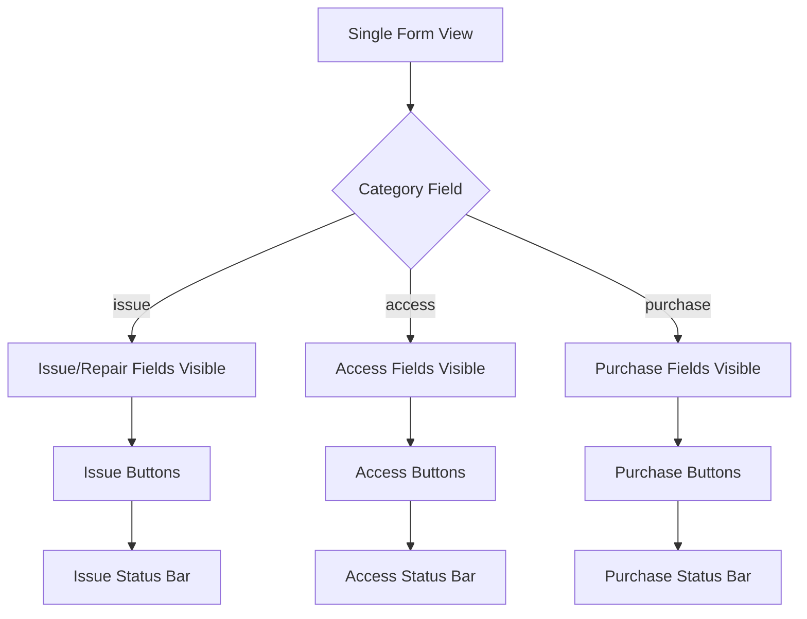
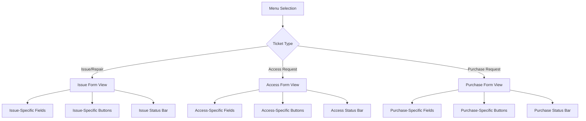
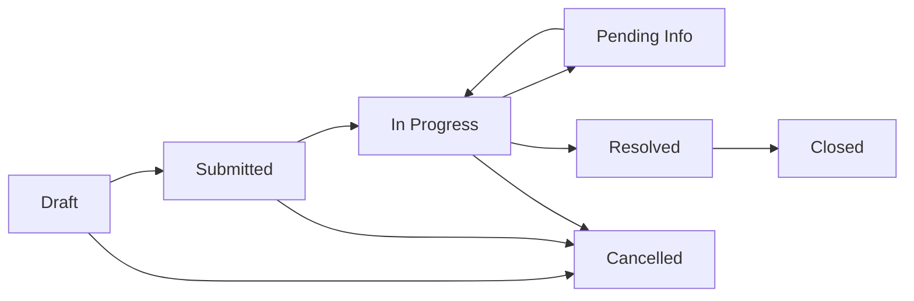
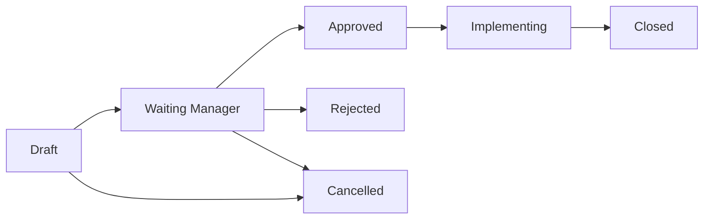
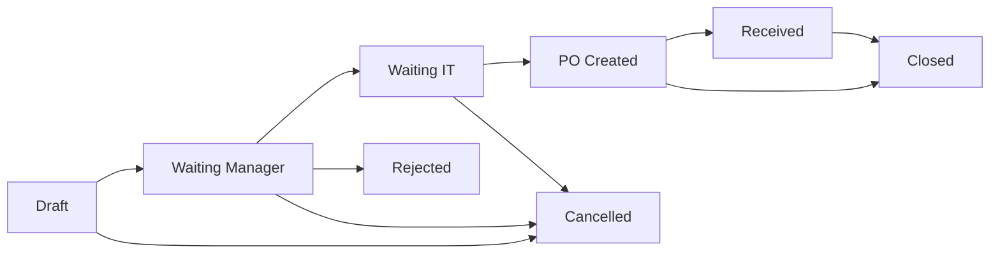

# IT Ticket Form Structure Diagram

## Current Structure (Single Form)

## New Structure (Separate Forms)

## Form Field Distribution

### Common Fields (All Forms)
- name (Ticket Number)
- priority
- employee_id (Requester)
- manager_id
- department_id
- it_responsible_id
- company_id
- user_id (Created By)
- create_date
- description
- attachment_ids
- sla_policy_id
- deadline_sla
- sla_breached
- iso_doc_code
- revision
- printed_count
- printed_by
- printed_at

### Issue/Repair Form - Unique Elements
- Status States: draft, submitted, in_progress, pending_info, resolved, closed
- Buttons: Submit Issue, Start Work, Need Info, Resolve, Close Issue, Cancel
- No specific fields (focus on description)

### Access Request Form - Unique Elements
- Status States: draft, waiting_manager, approved, implementing, closed
- Buttons: Submit Request, Approve, Reject, Start Implement, Mark Done, Cancel
- Fields: access_template_id, access_line_ids

### Purchase Request Form - Unique Elements
- Status States: draft, waiting_manager, waiting_it, po_created, received, closed
- Buttons: Submit Request, Approve, Reject, Create PO, Mark Received, Close Purchase, Cancel
- Fields: purchase_line_ids, purchase_id
- Stat Button: Purchase Order

## Workflow Comparison

### Issue/Repair Workflow

### Access Request Workflow

### Purchase Request Workflow

## Benefits of Separate Forms

1. **Improved User Experience**
   - Cleaner interface with only relevant fields
   - Clear workflow visualization
   - Reduced confusion

2. **Better Performance**
   - Smaller DOM trees
   - Faster loading
   - Less conditional rendering

3. **Easier Maintenance**
   - Independent form modifications
   - Clear separation of concerns
   - Reduced complexity

4. **Enhanced Extensibility**
   - Easy to add fields to specific ticket types
   - Custom workflows per ticket type
   - Better code organization