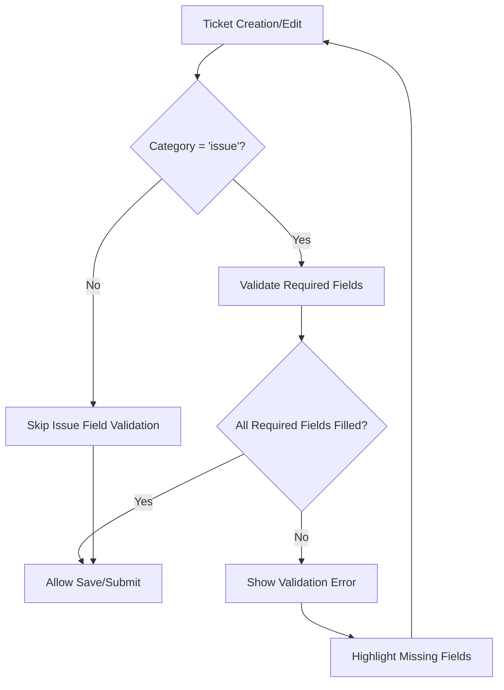
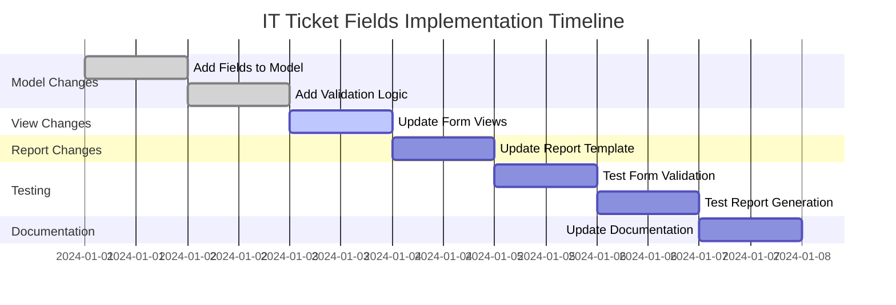
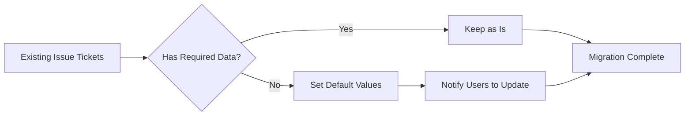

# IT Ticket Fields Implementation Diagram

## Current vs Proposed Issue Ticket Form Structure

### Current Issue Ticket Form Flow
```
┌─────────────────────────────────────┐
│           Header Buttons             │
├─────────────────────────────────────┤
│           Basic Information          │
│  • Ticket Number                    │
│  • Category                         │
│  • Priority                         │
│  • Requester                        │
│  • Manager                          │
│  • Department                       │
│  • IT Responsible                   │
├─────────────────────────────────────┤
│           Description               │
│  • Description Field                │
│  • Attachments                      │
├─────────────────────────────────────┤
│           Other Tabs                 │
│  • SLA Tracking                     │
│  • ISO Information                  │
└─────────────────────────────────────┘
```

### Proposed Issue Ticket Form Flow
```
┌─────────────────────────────────────┐
│           Header Buttons             │
├─────────────────────────────────────┤
│           Basic Information          │
│  • Ticket Number                    │
│  • Category                         │
│  • Priority                         │
│  • Requester                        │
│  • Manager                          │
│  • Department                       │
│  • IT Responsible                   │
├─────────────────────────────────────┤
│         Issue Details (NEW)         │
│  • Email (required)                 │
│  • ID LINE (required)               │
│  • Computer Name (required)         │
├─────────────────────────────────────┤
│      Symptoms/Issues (NEW)          │
│  • Symptoms/Issues (required)       │
│  • อาการเสีย (Thai label)          │
├─────────────────────────────────────┤
│           Description               │
│  • Description Field                │
│  • Attachments                      │
├─────────────────────────────────────┤
│           Other Tabs                 │
│  • SLA Tracking                     │
│  • ISO Information                  │
└─────────────────────────────────────┘
```

## Field Validation Logic Flow



## Report Template Changes

### Current Report Structure
```
Ticket Information Table:
┌─────────────────┬─────────────────┐
│ Ticket Number   │ Report Date     │
│ Requester       │ Department      │
│ Priority        │ IT Responsible  │
│ Create Date     │ Resolved Date   │
└─────────────────┴─────────────────┘
```

### Proposed Report Structure
```
Ticket Information Table:
┌─────────────────┬─────────────────┐
│ Ticket Number   │ Report Date     │
│ Requester       │ Department      │
│ Priority        │ IT Responsible  │
│ Create Date     │ Resolved Date   │
│ Email           │ ID LINE         │
│ Computer Name   │                 │
└─────────────────┴─────────────────┘

Symptoms/Issues Section (NEW):
┌─────────────────────────────────┐
│ Symptoms/Issues (อาการเสีย)    │
│ [Detailed symptoms text]        │
└─────────────────────────────────┘
```

## Database Schema Changes

### New Fields in it.ticket Table
```sql
ALTER TABLE it_ticket ADD COLUMN requester_email VARCHAR;
ALTER TABLE it_ticket ADD COLUMN line_id VARCHAR;
ALTER TABLE it_ticket ADD COLUMN symptoms TEXT;
ALTER TABLE it_ticket ADD COLUMN computer_name VARCHAR;
```

## Implementation Sequence



## User Experience Flow

### Issue Ticket Creation Process
1. User selects "IT Request" category
2. System shows new required fields section
3. User fills in:
   - Email (auto-populated from employee record)
   - ID LINE
   - Computer Name
   - Symptoms/Issues (อาการเสีย)
4. System validates all required fields
5. User can submit ticket

### Access/Purchase Ticket Creation Process
1. User selects "Access Request" or "Purchase Request"
2. System hides issue-specific fields
3. Process continues as normal without additional fields

## Migration Strategy

### For Existing Issue Tickets


### Default Values for Migration
- Email: Use employee work email if available
- ID LINE: Set to "To be updated"
- Symptoms: Copy from existing description field
- Computer Name: Set to "To be updated"