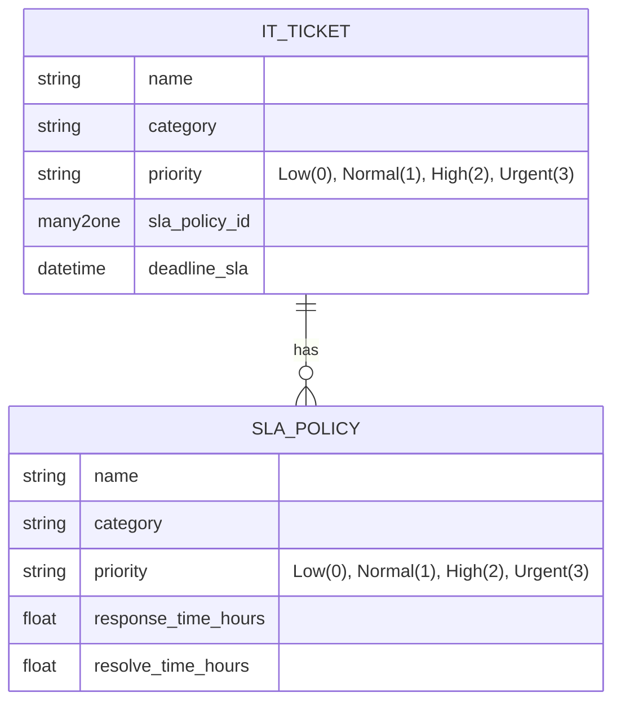
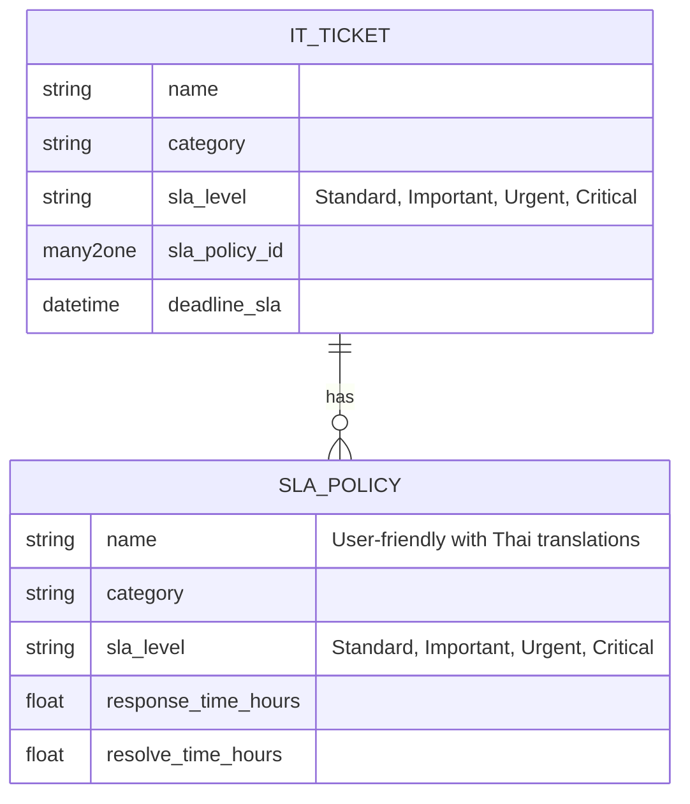

# SLA Policy Redesign Diagram

## Current Structure

## New Structure

## Mapping

| Old Priority | New SLA Level | Thai Translation |
|--------------|---------------|------------------|
| Low (0)      | Standard      | มาตรฐาน          |
| Normal (1)   | Important     | สำคัญ            |
| High (2)     | Urgent        | เร่งด่วน          |
| Urgent (3)   | Critical      | วิกฤต            |

## Example SLA Policy Names

| Category | Old Name | New Name |
|----------|----------|----------|
| Issue | Issue - Low Priority | Issue - Standard (มาตรฐาน) |
| Issue | Issue - Normal Priority | Issue - Important (สำคัญ) |
| Issue | Issue - High Priority | Issue - Urgent (เร่งด่วน) |
| Issue | Issue - Urgent Priority | Issue - Critical (วิกฤต) |
| Access | Access - Low Priority | Access - Standard (มาตรฐาน) |
| Access | Access - Normal Priority | Access - Important (สำคัญ) |
| Access | Access - High Priority | Access - Urgent (เร่งด่วน) |
| Access | Access - Urgent Priority | Access - Critical (วิกฤต) |
| Purchase | Purchase - Low Priority | Purchase - Standard (มาตรฐาน) |
| Purchase | Purchase - Normal Priority | Purchase - Important (สำคัญ) |
| Purchase | Purchase - High Priority | Purchase - Urgent (เร่งด่วน) |
| Purchase | Purchase - Urgent Priority | Purchase - Critical (วิกฤต) |