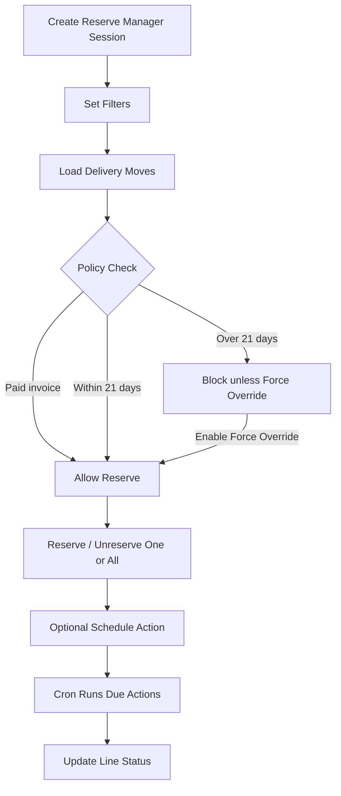

# Reserve Manager Flow

เอกสารนี้อธิบาย flow การทำงานของ `buz_reserve_manager` แบบสั้นและอ่านง่าย
สำหรับทีมใช้งานหน้างานและทีม support

## เป้าหมายของโมดูล

- ใช้จัดการจองสินค้าใน Sale Order จากหน้าเดียว
- โหลด delivery move ที่เกี่ยวข้องมาแสดงใน dashboard
- จอง / ปลดจอง / ตั้งเวลาจองได้จากหน้าจอเดียว
- รองรับ policy ธุรกิจ:
  - ออเดอร์ที่จ่ายแล้ว สามารถ lock stock ได้ทันที
  - ออเดอร์ที่ยังไม่จ่าย และ planned delivery เกิน 21 วัน จะถูก block ตาม policy
  - ถ้าต้องการให้ทำได้แบบ case-by-case ให้เปิด `Force Reservation Override`

## ภาพรวมการไหลของงาน

## Flow การใช้งาน

### 1) สร้าง Session

ผู้ใช้สร้าง `Reserve Manager` record ใหม่ 1 รายการต่อ 1 session

ข้อมูลหลักที่เลือกได้:

- Company
- Warehouse
- Customer
- Sale Orders
- Products
- Date From / Date To
- Reservation Status

### 2) กด Load

ระบบจะค้น `stock.move` ที่:

- อยู่ในสถานะ `draft`, `confirmed`, `waiting`, `partially_available`, `assigned`
- มี `sale_line_id`
- อยู่ใน company เดียวกับ session
- ตรงกับ filter ที่เลือก

ถ้าเจอ move:

- ระบบสร้าง line ใน `buz.reserve.manager.line`
- แสดง demand / reserved / available / scheduled date / state
- หน้า form จะ reload ทันที

ถ้าไม่เจอ:

- ระบบจะขึ้น error message ให้เห็นว่าฟิลเตอร์ไหนไม่ match

### 3) Policy Check ก่อนจอง

ก่อน reserve ระบบจะเช็ก policy ตามลำดับนี้

1. ถ้าเปิด `Force Reservation Override`
   - อนุญาตให้ reserve ได้
2. ถ้า sale order มี invoice ที่ `posted` และ payment state เป็น `paid` หรือ `overpaid`
   - อนุญาตให้ reserve ได้
3. ถ้า `scheduled_date` ของ move ยังไม่เกิน `Reservation Horizon Days` 
   - อนุญาตให้ reserve ได้
4. ถ้าเกิน horizon และไม่ได้ override
   - block การ reserve

ค่า default ของ horizon คือ `21` วัน

### 4) Reserve

Reserve ทำได้ 3 แบบ:

- กด `Reserve` ที่ line เดียว
- กด `Reserve All`
- ให้ cron ทำงานจาก scheduled action

ผลลัพธ์:

- ระบบเรียก Odoo stock reserve มาตรฐาน
- line จะอัปเดต reserved qty และ status
- หน้า form reload ทันที

### 5) Unreserve

Unreserve ทำได้ 3 แบบ:

- กด `Unreserve` ที่ line เดียว
- กด `Unreserve All`
- ให้ cron ทำงานจาก scheduled action

ผลลัพธ์:

- ระบบปล่อย stock reservation ออกจาก move
- line จะอัปเดตสถานะใหม่
- หน้า form reload ทันที

### 6) Schedule Action

ผู้ใช้สามารถกำหนด action ล่วงหน้าได้ในหน้าเดียว:

- เลือก `Scheduled Action`
  - `Reserve`
  - `Unreserve`
- กำหนด `Schedule At`
- กด `Apply Schedule`

ระบบจะเขียนค่าสถานะลงในทุก line ที่โหลดอยู่:

- `scheduled_action`
- `scheduled_action_at`
- `scheduled_action_state = pending`

### 7) Cron ทำงานอัตโนมัติ

มี scheduled action job ที่รันทุก 5 นาที

เมื่อถึงเวลาที่กำหนด:

- cron จะหา line ที่ `scheduled_action_state = pending`
- ตรวจว่าเวลาถึงแล้วหรือยัง
- ถ้าถึงแล้ว จะ execute action ให้อัตโนมัติ
- ผลลัพธ์จะถูกบันทึกลง line:
  - `Done`
  - `Failed`
  - message
  - time executed
  - executed by

## สถานะสำคัญบนหน้าจอ

- `Reserve Policy`
  - `Allowed`
  - `Paid Override`
  - `Blocked`
- `Schedule Status`
  - `Idle`
  - `Pending`
  - `Running`
  - `Done`
  - `Failed`
- `Reserve Status`
  - `Not Reserved`
  - `Partially Reserved`
  - `Fully Reserved`

## Example Use Cases

### Case 1: ลูกค้าจ่ายแล้ว

- Load SO
- ระบบเห็นว่า invoice paid
- Reserve ได้ทันที แม้ planned date จะไกล

### Case 2: ลูกค้ายังไม่จ่าย แต่ส่งไม่เกิน 21 วัน

- Load SO
- Policy อนุญาต
- Reserve ได้ตามปกติ

### Case 3: ลูกค้ายังไม่จ่าย และส่งเกิน 21 วัน

- Load SO
- Policy block การ reserve
- ถ้าต้องการจองจริง ให้เปิด `Force Reservation Override`

### Case 4: ตั้งเวลาจองไว้ล่วงหน้า

- Load SO
- ตั้ง `Scheduled Action = Reserve`
- ตั้งเวลา
- กด Apply Schedule
- cron จะทำงานเมื่อถึงเวลา

## จุดที่ต้องระวัง

- ถ้า move ถูก validate หรือ cancel ไปแล้ว line จะถูก refresh หรือหายจากหน้าจอ
- ถ้าไม่มี stock พอ ระบบอาจ reserve ได้ไม่ครบ
- `Force Reservation Override` เป็น override แบบ session-level ไม่ใช่ field VIP ถาวร

## สรุปสั้น

โมดูลนี้ทำหน้าที่เป็น reservation console แบบหน้าเดียว:

- โหลด move จาก SO
- เช็ก policy
- reserve / unreserve
- ตั้งเวลาทำงาน
- ให้ cron ช่วยรันอัตโนมัติ

