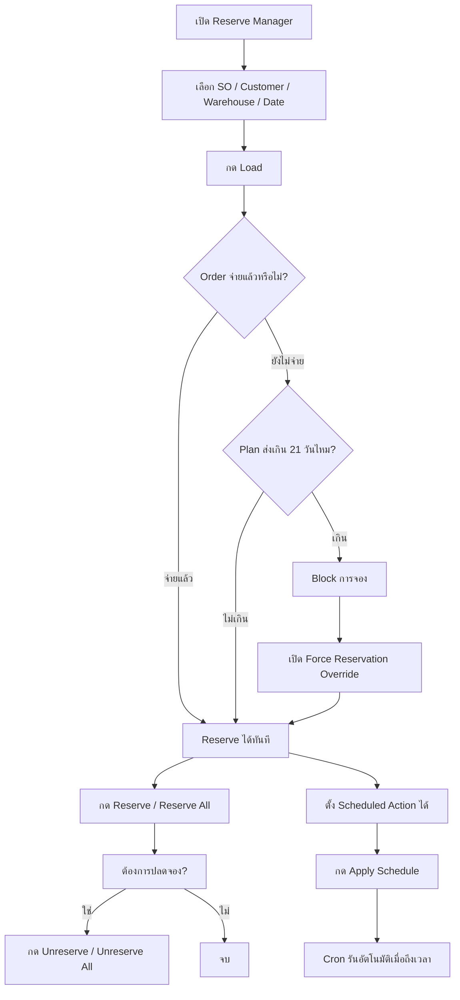

# Reserve Manager User Flow

## Flow การใช้งานแบบสั้น

## วิธีใช้

1. เปิดเมนู `Reserve Manager`
2. เลือก filter ที่ต้องการ
3. กด `Load`
4. ถ้า SO จ่ายแล้ว จะจองได้ทันที
5. ถ้ายังไม่จ่าย แต่ส่งไม่เกิน 21 วัน ก็จองได้
6. ถ้าเกิน 21 วัน ให้เปิด `Force Reservation Override`
7. ใช้ `Reserve`, `Unreserve`, `Reserve All`, `Unreserve All` ตามต้องการ
8. ถ้าต้องการทำล่วงหน้า ให้ตั้ง `Scheduled Action` แล้วกด `Apply Schedule`

## สรุป policy

- จ่ายแล้ว: จองได้
- ยังไม่จ่าย และส่งไม่เกิน 21 วัน: จองได้
- ยังไม่จ่าย และส่งเกิน 21 วัน: บล็อก
- ต้องการยกเว้นเป็นเคส: เปิด `Force Reservation Override`

