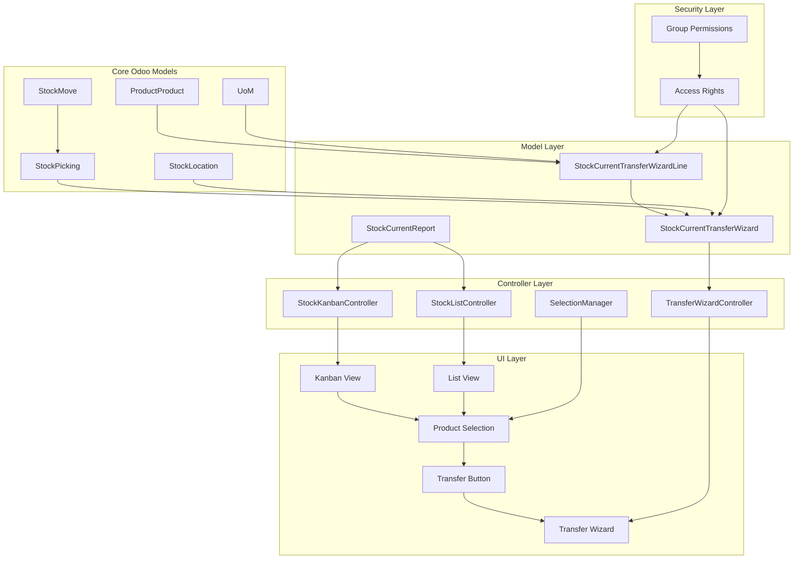
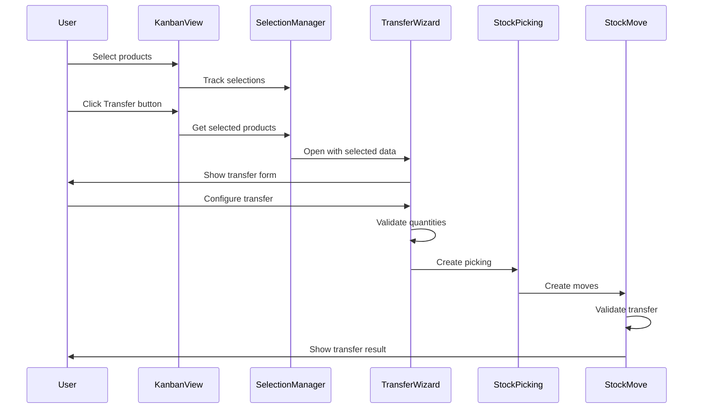
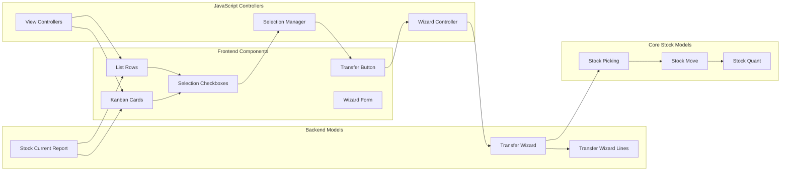
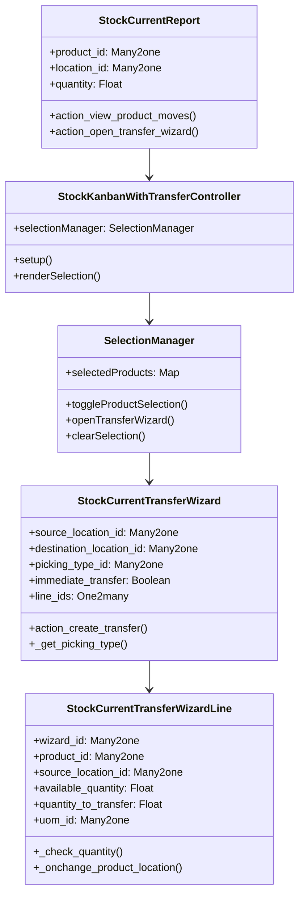
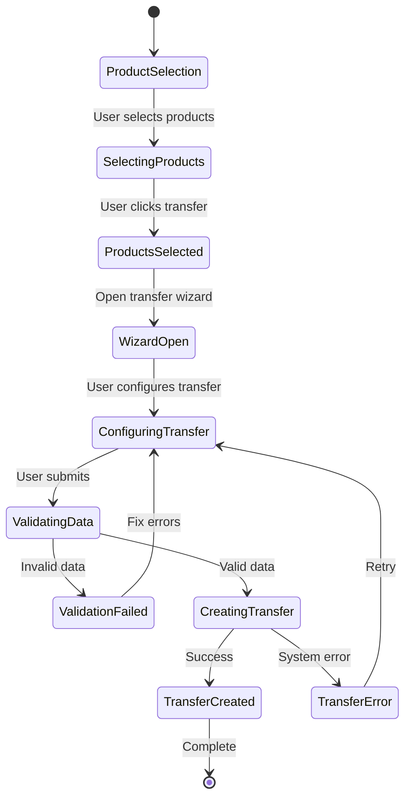
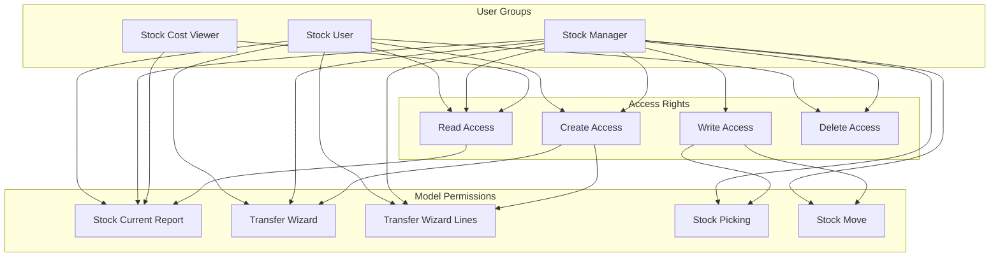
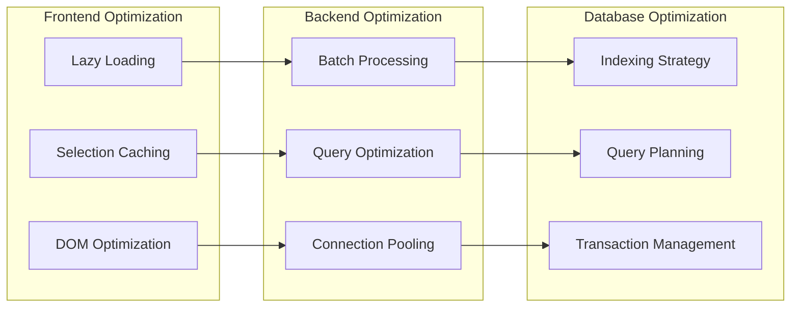

# Architecture Diagram: Easy Pick Product Transfer Feature

## System Architecture Overview



## Data Flow Diagram



## Component Interaction Diagram



## Class Diagram



## State Management Diagram



## Database Schema Diagram

```mermaid
erDiagram
    stock_current_report {
        int id PK
        int product_id FK
        int location_id FK
        float quantity
        float free_to_use
        float incoming
        float outgoing
    }
    
    stock_current_transfer_wizard {
        int id PK
        int source_location_id FK
        int destination_location_id FK
        int picking_type_id FK
        boolean immediate_transfer
        datetime scheduled_date
        text notes
    }
    
    stock_current_transfer_wizard_line {
        int id PK
        int wizard_id FK
        int product_id FK
        int source_location_id FK
        float available_quantity
        float quantity_to_transfer
        int uom_id FK
    }
    
    stock_picking {
        int id PK
        int picking_type_id FK
        int location_id FK
        int location_dest_id FK
        string state
    }
    
    stock_move {
        int id PK
        int picking_id FK
        int product_id FK
        int location_id FK
        int location_dest_id FK
        float product_uom_qty
        float quantity_done
    }
    
    stock_current_report ||--o{ stock_current_transfer_wizard_line : "provides data"
    stock_current_transfer_wizard ||--o{ stock_current_transfer_wizard_line : "has lines"
    stock_current_transfer_wizard ||--|| stock_picking : "creates"
    stock_picking ||--o{ stock_move : "contains"
}
```

## Security Architecture



## Performance Optimization Strategy



## Error Handling Flow

```mermaid
flowchart TD
    A[User Action] --> B{Validation Check}
    B -->|Valid| C[Execute Action]
    B -->|Invalid| D[Show Error Message]
    D --> A
    C --> E{System Response}
    E -->|Success| F[Show Success Message]
    E -->|Error| G[Log Error]
    G --> H[Show User-Friendly Error]
    H --> A
    F --> I[Update UI State]