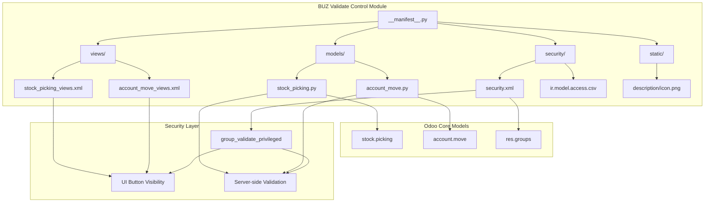
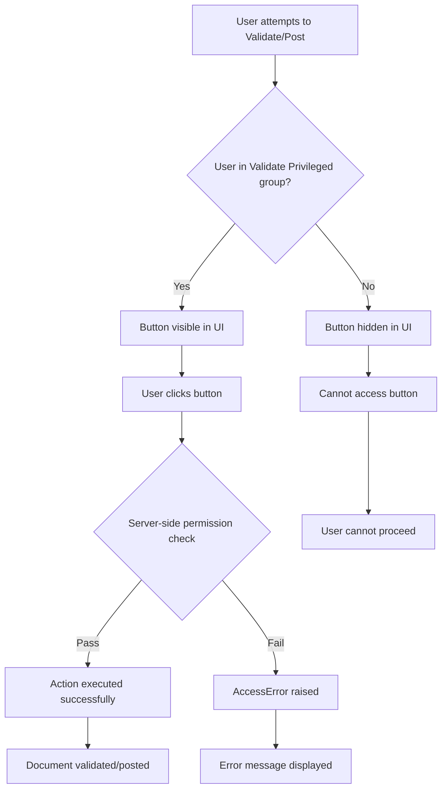
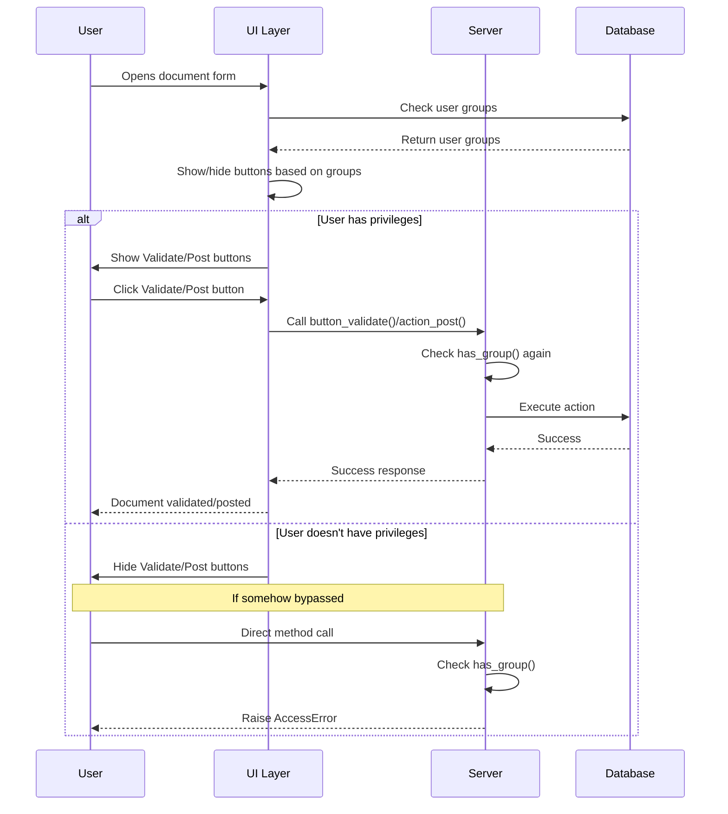

# BUZ Validate Control Module - Architecture Diagram

## Module Architecture Overview



## User Workflow



## Security Implementation Flow



## File Dependencies

```mermaid
graph LR
    subgraph "Core Dependencies"
        A[stock] --> D[stock.picking]
        B[account] --> E[account.move]
        C[base] --> F[res.groups]
    end
    
    subgraph "Module Files"
        G[__manifest__.py] --> H[models/stock_picking.py]
        G --> I[models/account_move.py]
        G --> J[views/stock_picking_views.xml]
        G --> K[views/account_move_views.xml]
        G --> L[security/security.xml]
    end
    
    H --> D
    I --> E
    J --> D
    K --> E
    L --> F