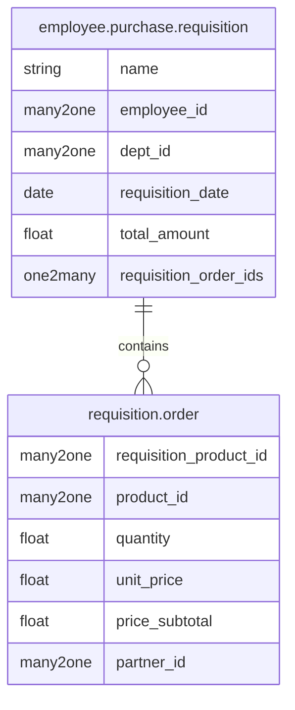
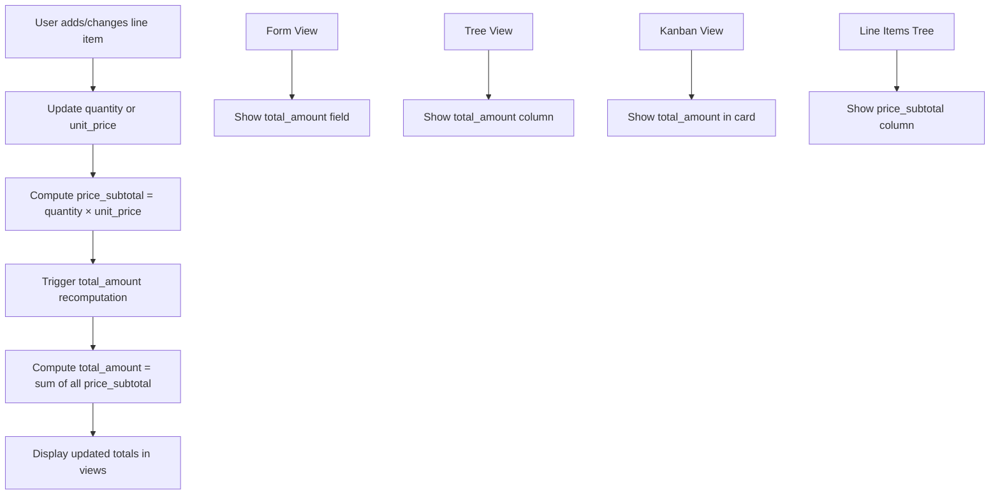
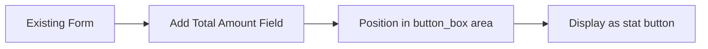
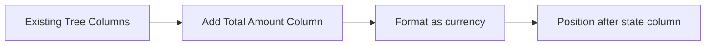
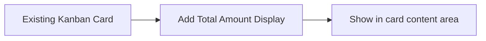

# Employee Purchase Requisition - Total Amount Implementation

## System Architecture



## Implementation Flow



## View Modifications

### Form View Changes


### Tree View Changes


### Kanban View Changes


## Data Flow

```mermaid
sequenceDiagram
    participant U as User
    participant F as Form View
    participant M as Main Model
    participant L as Line Model
    participant V as Views
    
    U->>F: Edit line item
    F->>L: Update quantity/price
    L->>L: Compute price_subtotal
    L->>M: Trigger onchange
    M->>M: Compute total_amount
    M->>V: Update all views
    V->>U: Display new totals