# Architecture Diagrams: Job Costing Management Module

This document provides comprehensive Mermaid diagrams illustrating the architecture, relationships, and data flow of the `job_costing_management` module.

---

## Table of Contents

1. [High-Level Architecture](#high-level-architecture)
2. [Entity Relationship Diagram](#entity-relationship-diagram)
3. [Job Cost Sheet Data Flow](#job-cost-sheet-data-flow)
4. [Material Requisition Workflow](#material-requisition-workflow)
5. [BOQ to Cost Line Flow](#boq-to-cost-line-flow)
6. [Purchase Order Integration](#purchase-order-integration)
7. [Timesheet Integration](#timesheet-integration)
8. [Invoice Integration](#invoice-integration)
9. [Class Diagram](#class-diagram)
10. [Security Model](#security-model)

---

## High-Level Architecture

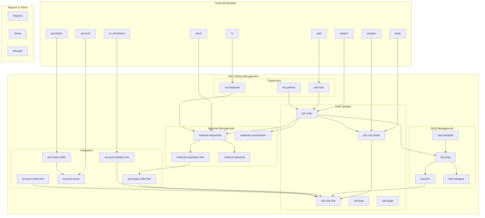

---

## Entity Relationship Diagram

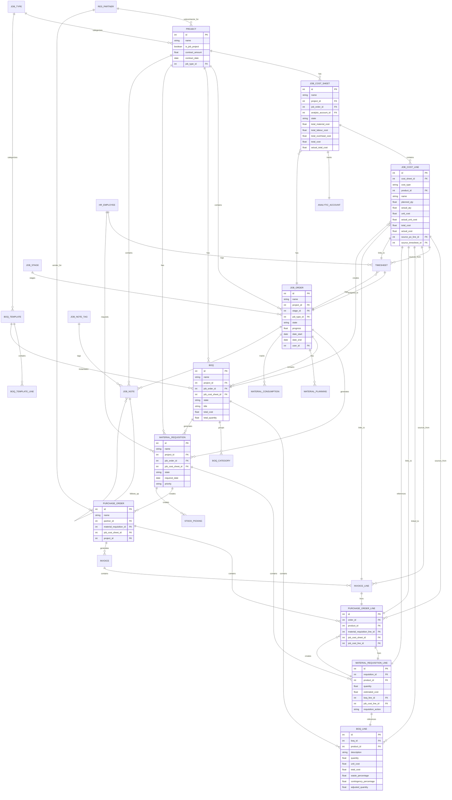

---

## Job Cost Sheet Data Flow

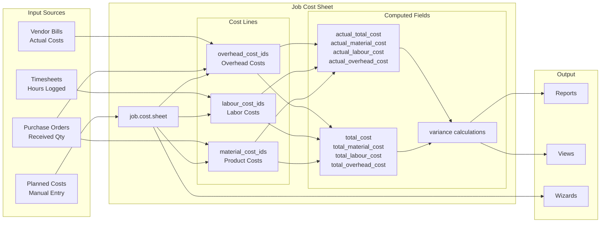

---

## Material Requisition Workflow

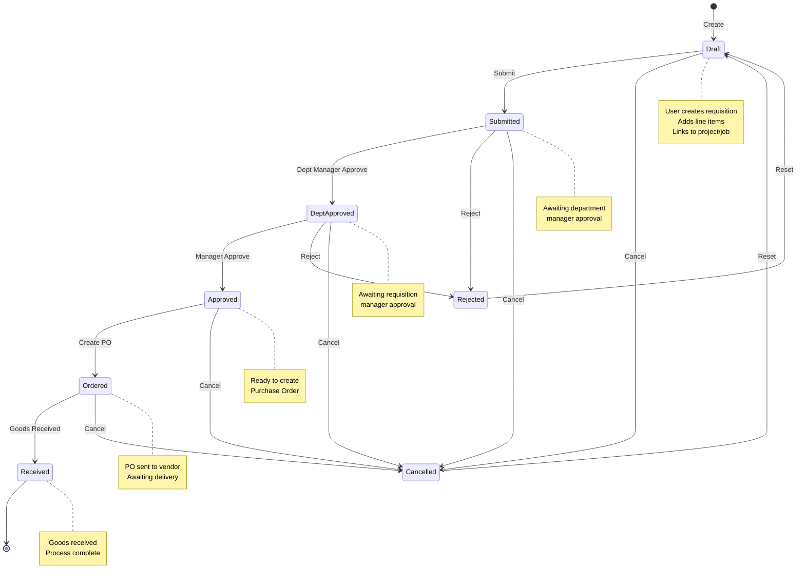

---

## BOQ to Cost Line Flow

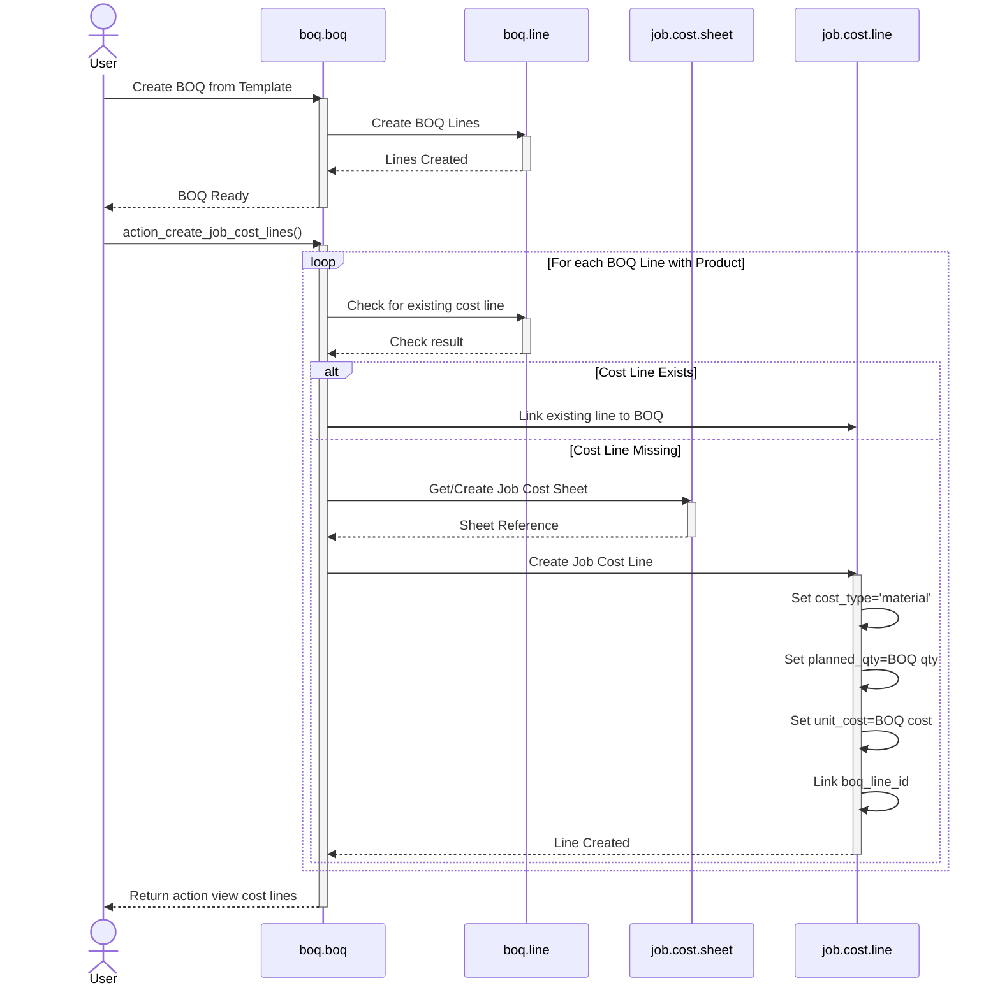

---

## Purchase Order Integration

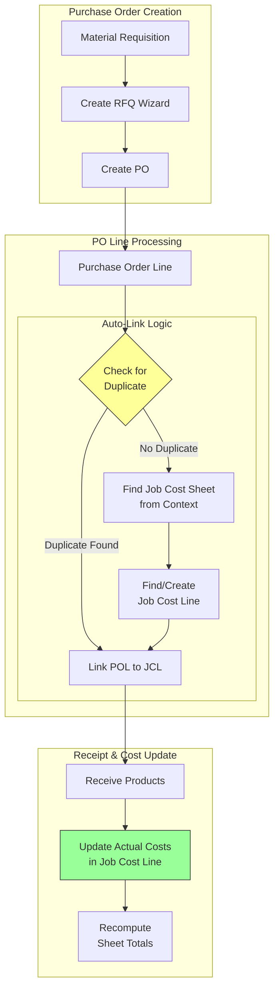

---

## Timesheet Integration

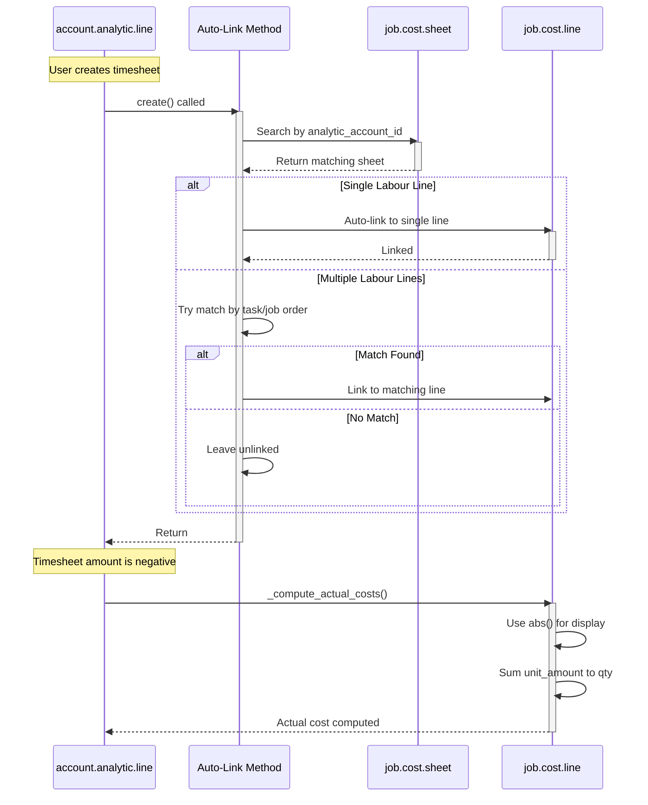

---

## Invoice Integration

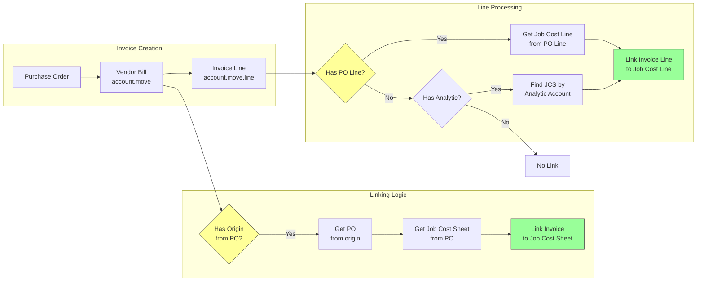

---

## Class Diagram

```mermaid
classDiagram
    class JobCostSheet {
        +Char name
        +Many2one project_id
        +Many2one job_order_id
        +Many2one analytic_account_id
        +Selection state
        +One2many material_cost_ids
        +One2many labour_cost_ids
        +One2many overhead_cost_ids
        +Float total_material_cost
        +Float total_labour_cost
        +Float total_overhead_cost
        +Float total_cost
        +Float actual_material_cost
        +Float actual_labour_cost
        +Float actual_overhead_cost
        +Float actual_total_cost
        +Float material_variance
        +Float labour_variance
        +Float overhead_variance
        +Float total_variance
        +Int purchase_order_count
        +Int timesheet_count
        +Int invoice_count
        
        +action_approve()
        +action_done()
        +action_cancel()
        +action_sync_actual_costs()
        +action_create_rfq()
        +action_view_purchase_orders()
        +action_view_timesheets()
        +action_view_invoices()
        +_compute_totals()
        +_compute_actual_costs()
        +_compute_variance()
    }
    
    class JobCostLine {
        +Many2one cost_sheet_id
        +Selection cost_type
        +Many2one product_id
        +Char name
        +Float planned_qty
        +Float actual_qty
        +Float unit_cost
        +Float actual_unit_cost
        +Float total_cost
        +Float actual_cost
        +Float qty_variance
        +Float cost_variance
        +Many2one uom_id
        +Many2one boq_line_id
        +Many2one source_po_line_id
        +Many2one source_timesheet_id
        +Many2one source_invoice_line_id
        
        +_compute_total_cost()
        +_compute_actual_qty()
        +_compute_actual_unit_cost()
        +_compute_actual_cost()
        +_compute_variance()
        +update_actual_costs_from_purchases()
        +get_or_create_cost_line()
    }
    
    class JobOrder {
        +Char name
        +Many2one project_id
        +Many2one task_id
        +Many2one stage_id
        +Selection state
        +Float progress
        +Date date_start
        +Date date_end
        +Many2one user_id
        +One2many job_cost_sheet_ids
        +One2many material_requisition_ids
        +One2many timesheet_ids
        +One2many boq_ids
        
        +action_start()
        +action_done()
        +action_cancel()
        +action_view_cost_sheets()
        +action_view_timesheets()
        +action_view_material_requisitions()
        +_compute_costs()
        +_compute_counts()
    }
    
    class MaterialRequisition {
        +Char name
        +Many2one project_id
        +Many2one job_order_id
        +Many2one job_cost_sheet_id
        +Many2one boq_id
        +Selection state
        +Date required_date
        +Selection priority
        +One2many line_ids
        +Float total_cost
        
        +action_submit()
        +action_dept_approve()
        +action_approve()
        +action_reject()
        +action_create_purchase_order()
        +action_create_picking()
        +_compute_total_amount()
    }
    
    class BOQ {
        +Char name
        +Many2one project_id
        +Many2one job_order_id
        +Many2one job_cost_sheet_id
        +Selection state
        +Char title
        +One2many line_ids
        +One2many category_ids
        +Float total_quantity
        +Float total_cost
        +Float total_requisitioned_amount
        +Float overall_purchase_progress
        
        +action_approve()
        +action_lock()
        +action_create_material_requisition()
        +action_create_job_cost_lines()
        +_compute_totals()
        +_compute_purchase_totals()
    }
    
    class BOQLine {
        +Many2one boq_id
        +Many2one product_id
        +Text description
        +Float quantity
        +Float unit_cost
        +Float total_cost
        +Float waste_percentage
        +Float contingency_percentage
        +Float adjusted_quantity
        +Float adjusted_total_cost
        +Float total_requisitioned_qty
        +Float total_ordered_qty
        +Float total_received_qty
        +Float remaining_qty
        +Selection status
        
        +_compute_total_cost()
        +_compute_adjusted_values()
        +_compute_purchase_tracking()
        +_compute_status()
    }
    
    class PurchaseOrder {
        +Many2one material_requisition_id
        +Many2one job_cost_sheet_id
        +Many2one project_id
        +Many2one job_order_id
        
        +button_confirm()
        +_update_job_cost_sheet_actual_costs()
    }
    
    class PurchaseOrderLine {
        +Many2one material_requisition_line_id
        +Many2one job_cost_sheet_id
        +Many2one job_cost_line_id
        +Many2one analytic_account_id
        
        +_onchange_job_cost_sheet_id()
        +_onchange_job_cost_line_id()
        +_onchange_analytic_account_id()
    }
    
    class AccountMove {
        +Many2one job_cost_sheet_id
        +Many2one project_id
        +Many2one job_order_id
    }
    
    class AccountMoveLine {
        +Many2one job_cost_line_id
        
        +_onchange_analytic_distribution()
    }
    
    class AccountAnalyticLine {
        +Many2one job_cost_line_id
        +Many2one job_order_id
        
        +_auto_link_to_job_cost_line()
        +action_create_job_cost_line()
    }
    
    %% Relationships
    JobCostSheet "1" --> "*" JobCostLine : contains
    JobCostSheet "1" --> "*" MaterialRequisition : linked
    JobOrder "1" --> "*" JobCostSheet : has
    JobOrder "1" --> "*" MaterialRequisition : generates
    JobOrder "1" --> "*" BOQ : contains
    MaterialRequisition "1" --> "*" PurchaseOrder : creates
    PurchaseOrder "1" --> "*" PurchaseOrderLine : contains
    PurchaseOrder "1" --> "1" AccountMove : generates
    BOQ "1" --> "*" BOQLine : contains
    BOQ "1" --> "*" JobCostLine : creates
    JobCostLine "1" --> "*" PurchaseOrderLine : sources
    JobCostLine "1" --> "*" AccountAnalyticLine : sources
    JobCostLine "1" --> "*" AccountMoveLine : sources
```

---

## Security Model

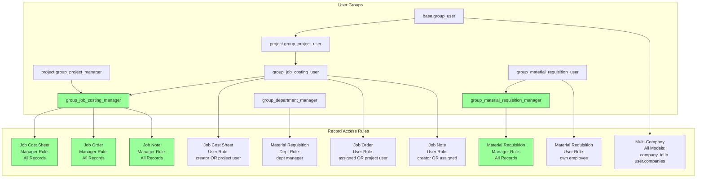

---

## Data Synchronization Flow

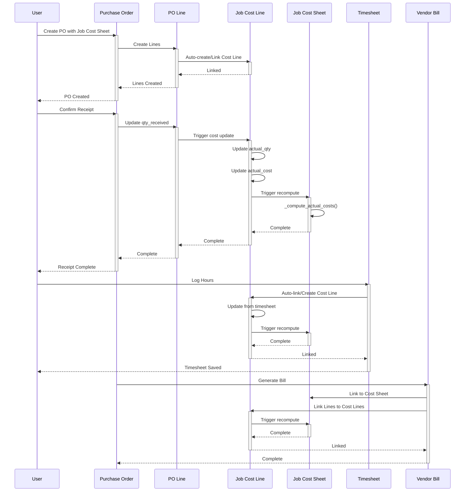

---

## Summary

These diagrams illustrate:

1. **Modular Architecture** - Clear separation of concerns between core costing, material management, BOQ, and integration components

2. **Complex Relationships** - Many-to-many relationships between projects, job orders, cost sheets, and external documents

3. **Automated Data Flow** - Purchase orders, timesheets, and invoices automatically update cost line actual costs

4. **Multi-Level Security** - Hierarchical access control with user, department manager, and global manager levels

5. **State-Driven Workflows** - Material requisitions follow a defined approval workflow with multiple checkpoints

6. **Duplicate Prevention** - Source tracking fields prevent duplicate cost line creation

7. **Variance Tracking** - Real-time comparison between planned and actual costs with automatic recomputation
